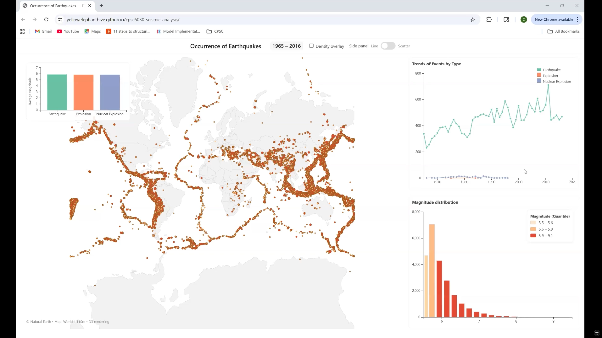

# Seismic Analysis — Interactive Earthquake Visualization (D3.js)

<!-- Demo Video -->
## 🎥 Demo Video
Watch the full interactive demo here:  
[https://vimeo.com/1144394294](https://vimeo.com/1144394294)

[](https://vimeo.com/1144394294)

---

This project is an interactive visualization of global earthquake activity (1900–2016) built with **D3.js v7**. It provides intuitive tools to explore earthquakes across **time**, **location**, **magnitude**, **depth**, and **event types**, supported by interactive filtering and dynamic visual encodings.

---

## 🔍 Key Features

### **1. Global Earthquake Map**
- Earthquakes plotted by geographic coordinates.
- Circle radius encodes magnitude; color encodes quantile-based magnitude bins.
- Zoom and pan supported.
- Tooltip provides magnitude, depth, location, year, and event type.
- The map dynamically updates when:
  - Time range changes  
  - Event type filters change  
  - User selects years in the line chart  

---

### **2. Interactive Time Range Control**
- Synchronized numeric inputs and slider.
- Default view loads **full range (1965–2016)**.
- Line-chart year markers are clickable:
  - Clicking one year filters the map to that year.
  - Clicking two years selects a year interval.
  - Clicking a selected point again cancels it.

---

### **3. Event Type Filters**
Users may toggle the visibility of:
- Earthquake  
- Explosion  
- Nuclear Explosion  
- Rock Burst  

All views (map, histogram, line chart, bar chart, scatter plots) update accordingly.

---

### **4. Magnitude Distribution Histogram**
- Uses global magnitude extent for consistent axes.
- Bins magnitude into 20 intervals.
- Color follows quantile thresholds.
- Auto-updates based on active filters.
- Each bar is independently selectable; clicking a bar filters the map to earthquakes whose magnitudes fall within that bar’s range.

---

### **5. Trends Line Chart (Updated)**
- When **no event type is selected**, the chart displays **multiple lines**, one per type, each using consistent color coding.
- When a **specific type is selected**, only its trend line is shown.
- Each year is represented by a point, which can be clicked to filter the map.
- A dynamic legend is generated based on currently displayed event types.
- Selected years now display vertical guide lines; selecting two years shows an interval with dimmed out-of-range regions.

---

### **6. Average Magnitude Bar Chart (Updated)**
- Displays average magnitude for each event type within the active time range.
- Bar colors match the type-filter color scheme.
- Labels are horizontal for improved readability.
- Previously used for event‑type filtering, now functions only as a descriptive summary.
- No longer triggers filtering of the map.

---

### **7. Scatter Plot Mode (Updated)**
Two scatterplots are available:
- **Magnitude vs. Horizontal Distance**
- **Magnitude vs. Depth**

Updates include:
- Scatter points now use event-type color mapping.
- When switching to scatter mode, the time range resets to the full range for clarity.
- Magnitude filtering from histogram selection also applies in scatter mode.

---

### **8. Density Overlay**
Optional tectonic-density visualization using contour density estimation:
- Highlights plate boundaries and high-density clusters.
- Toggle switch provided.

---

## 🧭 Design Improvements (Final Revision)
- Replaced the event-type bar chart with a magnitude-distribution histogram in the side panel.
- Swapped the histogram and average-magnitude bar chart positions for better visual hierarchy.
- Added vertical selection markers to the line chart (one or two red guide lines) when users click year points.
- Added dimming of out-of-range years when interval selection is active.
- Enabled per‑bar magnitude filtering: clicking any bar in the histogram filters map earthquakes to that bin.
- Histogram bars now highlight individually (not by quantile group), with non-selected bars dimmed.
- Histogram filtering is now aligned with quantile-based coloring so only correctly colored points appear on the map.
- Map updates now prioritize magnitude selection over event type.
- Magnitude legend repositioned inside the histogram card.

---

## 🗂 Project Structure

```
Seismic Analysis/
│── index.html
│── style.css            # Updated styling, centered layout, panel hiding
│── script.js            # Enhanced filtering, legend, multi-line trends, scatter logic
│── database.csv
│── all.csv
│── README.md
```

---

## 📦 Setup

Clone the repository:

```
git clone https://github.com/YOUR_USERNAME/seismic-analysis.git
cd seismic-analysis
```

Start a local server (CSV loading requires HTTP):

```
python3 -m http.server
```

Open:

```
http://localhost:8000/
```

---

## 👥 Contributors
- Yu-Chun Lai  
- Sanjeev Sharma  
- Connor McGrath  
